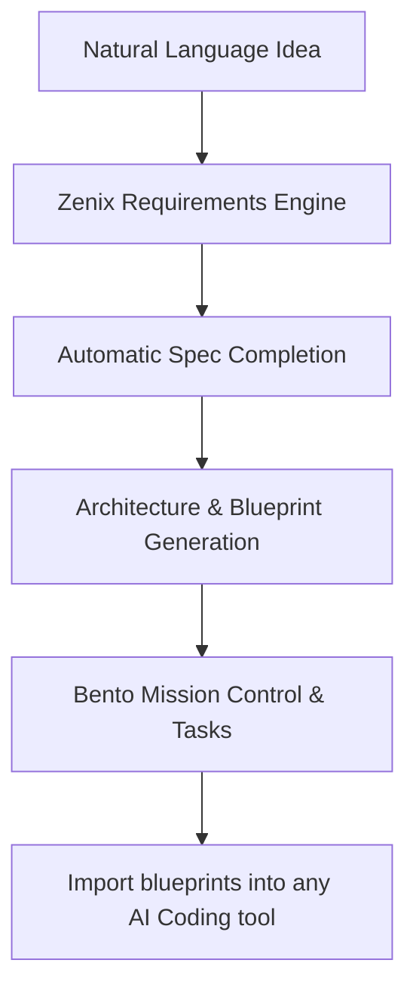

# Zenix — Developer-First AI Context Synthesis Workspace

Zenix transforms rough software ideas into complete, implementation-ready development context for AI coding agents. 

Instead of repeatedly explaining a project's architecture, dependencies, guidelines, and database structures to different AI assistants, Zenix structures everything into a single, unified source of truth. The generated context blueprints can be immediately imported into Cursor, Windsurf, Claude Code, Gemini CLI, or any other LLM workflow to achieve predictable, zero-drift code generation.

---

## The Zenix Workflow



1. **Describe**: Enter your rough software idea or product direction in natural language.
2. **Synthesize**: Zenix analyzes the core product principles, highlights missing requirements, and completes technical recommendations automatically.
3. **Blueprint**: A full suite of Markdown-based AI rules, specifications, and architecture blueprints is created.
4. **Build**: Break down implementation plans into atomic developer tasks and start coding with 100% context alignment.

---

## Core Features

### 1. AI Context Blueprint Engine
Generates standard markdown-based codebase guides that align all downstream coding assistants to the exact same architectural vision.
* **AGENTS.md / GEMINI.md**: Strict operational rules, personality profiles, and technical instructions.
* **architecture.md**: Folder structures, technology dependencies, and modular layout specifications.
* **ui-tokens.md / ui-rules.md**: Theme colors, spacing scales, typography variables, and wrapping safety criteria.
* **code-standards.md**: Maximum file length limits, state-management directives, and API isolation patterns.

### 2. Interactive AI Playground
* A real-time sandbox built to iterate on UI layouts, tweak design tokens, and preview HTML/JS previews live.
* Allows developers to tweak variables and see updates render dynamically without manual refreshes.

### 3. Bento Task Control & Mission Boards
* Decomposes product plans into actionable, step-by-step implementation missions.
* Breaks down complex modules into atomic task lists equipped with strict validation criteria.
* Staggered, hover-glowing Bento layouts that organize information architecture intuitively.

### 4. Creator Community & Marketplace
* Search, follow, download, and fork verified project blueprints and context templates.
* User profile cards displaying loyalty badges, user preferences, and custom template portfolios.

### 5. Developer-First Security & Preferences
* Secure session authentication built using JSON Web Tokens (JWT).
* Responsive, system-aware Light (White Canvas) and Dark (Pure Black) themes.
* Floating glassmorphic navigation bars and keyboard-navigable interactive tooltips.

---

## Project Architecture

Zenix uses **Feature-Based Architecture** to keep the codebase modular, readable, and highly maintainable:

* **src/pages/**: Ultra-thin routing layers. They carry no business logic, state management, or API calls.
* **src/features/**: Standalone product modules (e.g., `auth`, `projects`, `explore`, `profile`) containing their own APIs, custom hooks, state stores, and UI components.
* **src/shared/**: Reusable utilities, providers, layout wrappers, and design-system components.

---

## Getting Started

### Prerequisites
* Node.js (v18+)
* MongoDB / Postgres (configured via workspace credentials)

### Installation

1. Clone the repository:
   ```bash
   git clone https://github.com/RandintRayquaza/laughing-giggle.git
   ```

2. Install dependencies:
   ```bash
   npm install
   ```

3. Spin up the local development server:
   ```bash
   npm run dev
   ```

4. Build the production package:
   ```bash
   npm run build
   ```
